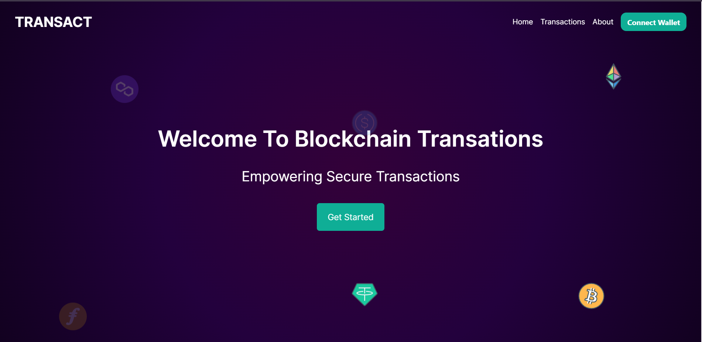

## Steps to Run this Project locally.

1. Make a folder on you machine.

```bash
mkdir my-project
cd my-project
```

2. Clone the repo into you folder (make sure you have git in your system)

```bash
  git clone https://github.com/Vikramop/mintair-assessment-fe.git
```

3. Install the dependencies

```bash
 npm install
```

Now this project requires an etherscan api key, so go to [Etherscan](https://etherscan.io/) make an account. In profile section head over to api create an api key. copy the api key token and paste it into [next.config.mjs] file of the project.

```js
const nextConfig = {
  env: {
    ETHERSCAN_API_KEY: 'XXXXXXXXXXXXXXXXXXXXXXXXXXXX',
    ADDRESS: '0xa83114A443dA1CecEFC50368531cACE9F37fCCcb',
  },
};

export default nextConfig;
```

4. Now let's run the Devlopment server.

```bash
npm run dev
# or
yarn dev
# or
pnpm dev
```

5. Now the home screen must appear.
 <div align="center">
  <p align="center">Home Page</p>
  
</div>

- Note You can further run the application if you have metamask install in you system, Learn more about [Metamask here](https://investorsupport.securitize.io/hc/en-us/articles/5679405490711-How-to-Install-Metamask-on-Your-Desktop-Browser#:~:text=Installing%20MetaMask&text=Getting%20started%20with%20MetaMask%20is,you%20download%20the%20correct%20software.&text=Now%2C%20if%20you%20use%20Chrome%2C%20click%20Install%20Metamask%20for%20Chrome.).
